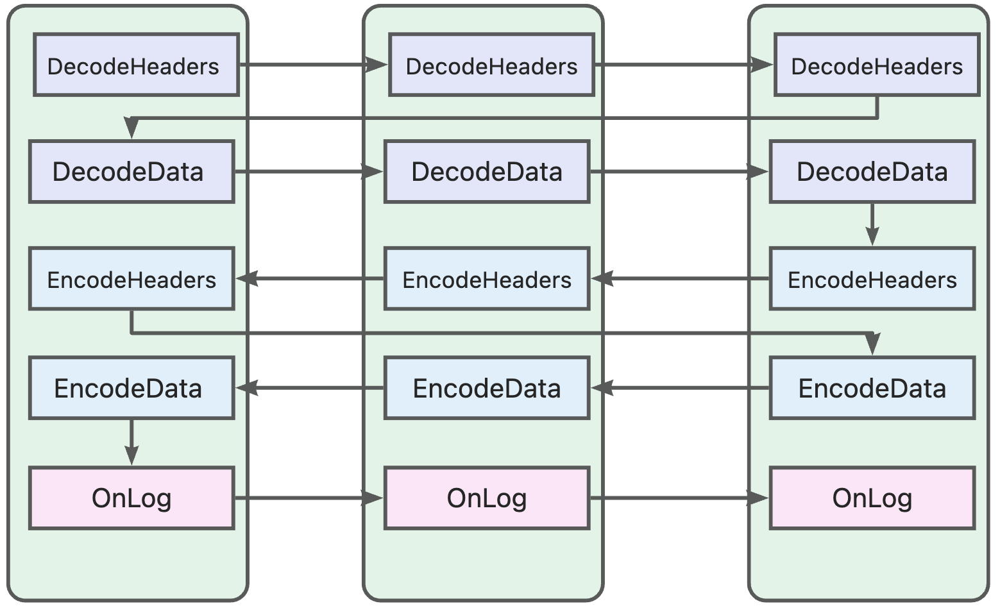
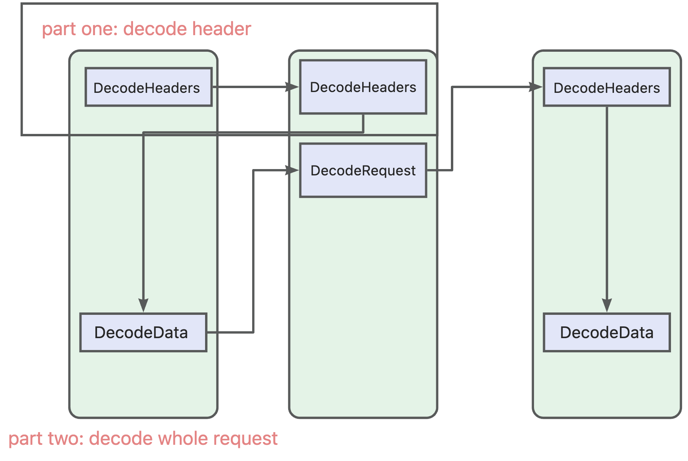

# Plugin development

## How to write a plugin

1. Create a directory under `./plugins/`.
2. Think about the configuration and write down it into `./plugins/$your_plugin/config.proto`. Then run `make gen-proto`.
3. Finish the plugin. Don't forget to write tests. You can take `./plugins/demo` as the example.
4. Add the doc of the plugin in the `./plugins/$your_plugin/README.md`.
5. Add your plugin's package into `./plugins/plugins.go`. Run `make build-so`. Now the plugin is compiled into `libgolang.so`.
6. Add integration test in the `./plugins/tests/integration/`. For how to run the integration test, please read `./plugins/tests/integration/README.md`.

## Filter manager

The MOE project introduces filter manager between the Envoy Go filter and the Go Plugins.

Filter manager makes the features below possible:

* Go plugins can be run in goroutine by default, ensure the business logic is non-blocking.
* Reduce CGO calls and increase Go side cache hit.
* Allow additional workflow which is different from Envoy, for example, running extra plugins according to the authenticated user.

### Design of the filter manager

Assumed we have three plugins called `A`, `B` and `C`. They are configured in this order:

```
plugins:
- name: A
  config:
    foo: bar
- name: B
  config:
    pet: cat
- name: C
  config:
    toy: pen
```

For each plugin, the calling order of callbacks is:

1. DecodeHeaders
2. DecodeData
3. EncodeHeaders
4. EncodeData
5. OnLog

When processing the request (Decode path), the calling order is `A -> B -> C`.
When processing the response (Encode path), the calling order is `C -> B -> A`.
When logging the request, the calling order is `A -> B -> C`.



Note that this picture shows the main path. The execution path may have slightly difference. For example,

* If the request doesn't have body, the `DecodeData` won't be called.
* If the request is replied by Envoy before sending to the upstream, we will leave the Decode path and enter the Encode path.
For example, if the plugin B rejects the request with some custom headers, the Decode path is `A -> B` and the Encode path is `C -> B -> A`.
The custom headers will be rewritten by the plugins. This behavior is equal to Envoy.

In some situations, we need to stop the iteration of header filter, then read the whole body. For instance,

1. Authorization with request body.
2. Modify the body, and change the headers (`content-length` and so on).

Therefore, we introduce a group of new types:

* WaitAllData: a ResultAction returns from the EncodeHeaders
* DecodeRequest(headers api.RequestHeaderMap, data api.BufferInstance, trailers api.RequestTrailerMap) ResultAction

`WaitAllData` can be used to decide if the body needs to be buffered, according to the configuration and the headers.

If `WaitAllData` is returned, we will:

1. buffer the whole body
2. execute the `DecodeData` of previous plugins
3. execute the `DecodeRequest` of this plugin
4. back to the original path, continue to execute the `DecodeHeaders` of the next plugin



The same process applies to Encode path, but in a slightly different way. Method `EncodeResponse` is called instead.
